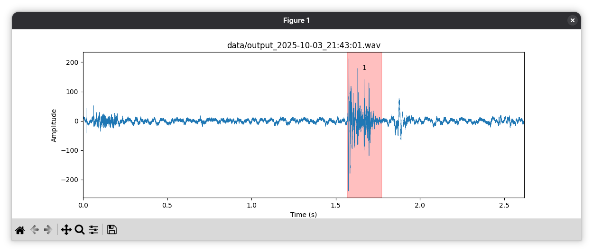
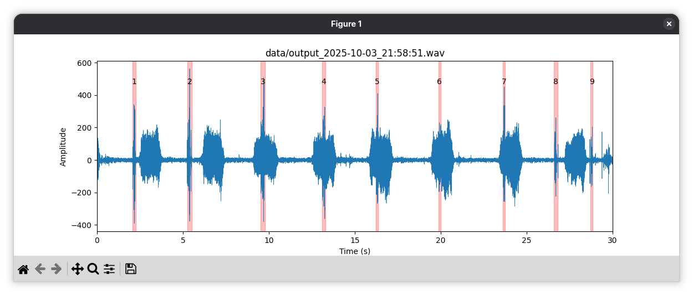
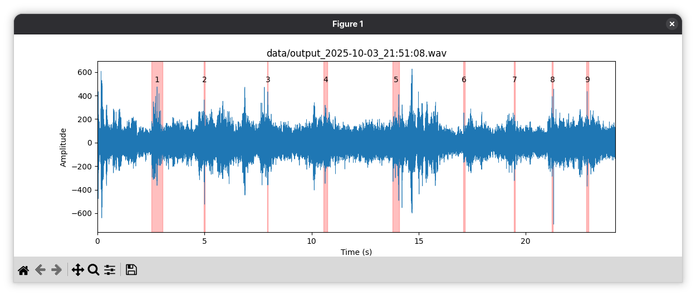
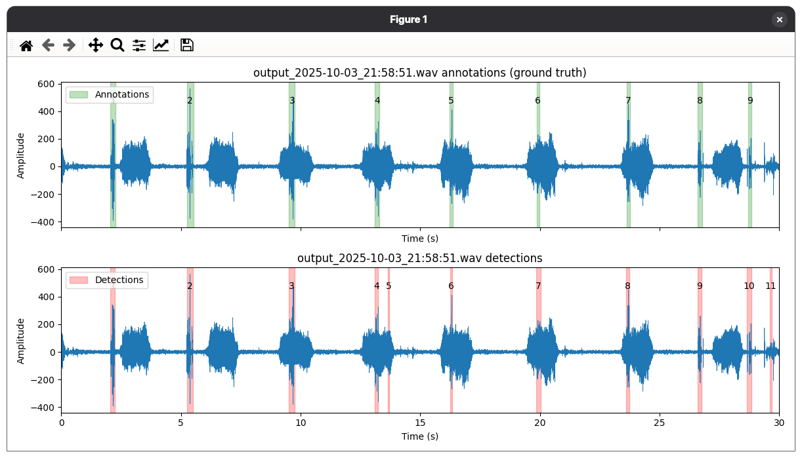
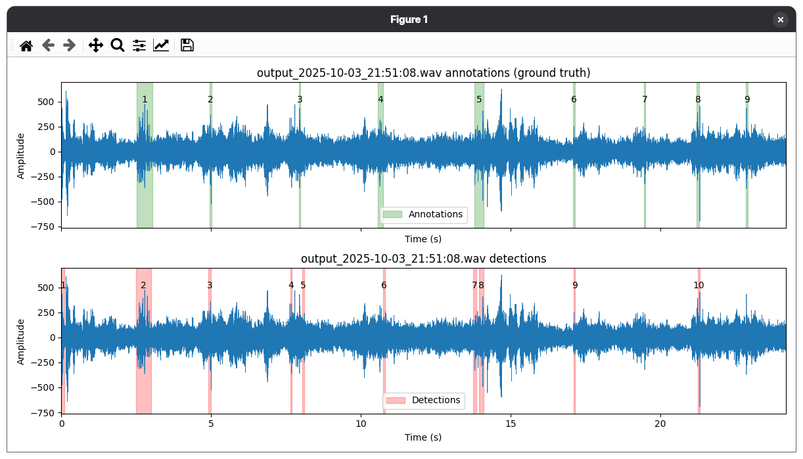

# Mehurcki

Zvočni detektor mehurčkov

Projekt za predmet Matematika z računalnikom na UL FMF.

[Poročilo](report.pdf)

## Predpriprava

```
uv sync
```

## Uporaba

### 1. Vizualizacija zvočnega posnetka
```
uv run src/main.py visualize_waveform output_2025-10-03_21:51:08.wav
```

### 2. Testiranje posameznega detektorja
```
uv run src/main.py train_detector constant_true
uv run src/main.py train_detector svm --preprocessor stft
```
(ne prikazuje vizualizacij)

### 3. Vizualizacija detekcij
```
uv run src/main.py train_detector constant_true --file output_2025-10-03_21:51:08.wav
```

### 4. Testiranje vseh detektorjev
```
uv run src/main.py train_detector
```
(ne prikazuje vizualizacij)

### V splošnem
```
uv run src/main.py train_detector [detector] [--preprocessor preprocessor] [--file filename]
```
Možni detektorji: `constant_true`, `svm`, `random_forest` (privzeto: vsi).  
Možni predprocesorji: `identity`, `wavelet`, `continuous_wavelet`, `stft` (privzeto: `identity`).  
Možni zvočni posnetki: ime `.wav` datoteke v mapi `data/` (privzeto: vse).

# Primeri

## Anotacije podatkov




## Detekcije


